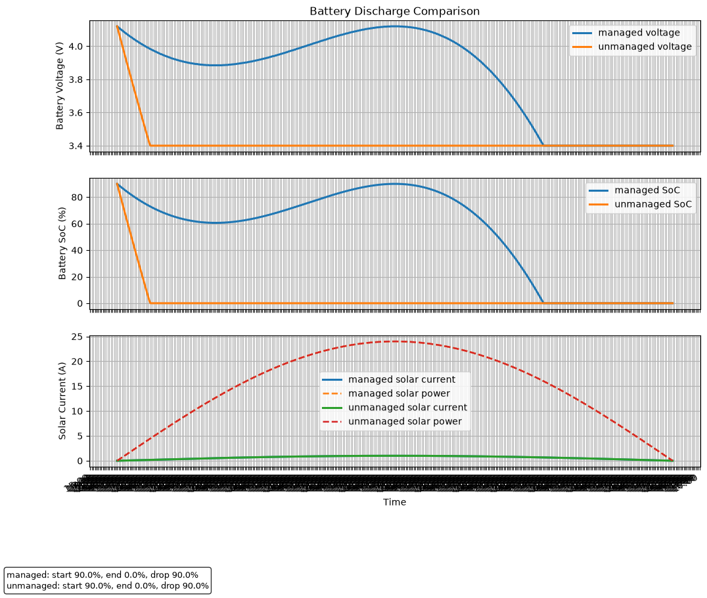

# ESP32 MQTT Power Management

This repository contains an Arduino/ESP32 firmware project that collects battery and solar telemetry, publishes sensor data over MQTT, and performs automatic load optimisation.

## Features

- Connects to WiFi and an MQTT broker using secure WebSocket (WSS)
- Publishes telemetry for:
  - temperature
  - battery voltage and state of charge
  - solar voltage, current, power, and energy
  - power estimator and available current
- Supports automatic optimisation of loads using a Best-First Search tree
- Uses `ArduinoJson` to publish structured JSON telemetry
- Includes a command queue and MQTT command handling

## Hardware and firmware components

- ESP32-based Arduino project
- `Adafruit_INA219` battery/solar sensor support
- `WiFiManager` for network connectivity
- `MQTTManager` for broker communication and message handling
- `PowerEstimator` and `BestFirstSearch` for load scheduling
- `TimeManager` for NTP-based timestamping

## Configuration

Update `config/Config.h` with your environment settings before building:

- `WIFI_SSID`
- `WIFI_PASSWORD`
- `MQTT_HOST`
- `MQTT_PORT`
- `MQTT_CLIENT_ID`

Also configure MQTT topics and timing intervals in `config/Config.h`.

## MQTT Topics

The firmware uses these default topics for telemetry and control.

Publish telemetry:

- `esp32/telemetry/temperature`
- `esp32/telemetry/battery`
- `esp32/telemetry/solar`
- `esp32/telemetry/estimator`
- `esp32/telemetry/ping`
Topic access groups:

- User-facing topics: intended for normal clients, dashboards, and operators.
  - `esp32/command/test`
  - `esp32/command/config/list`
  - `esp32/command/config/get_node`
  - `esp32/command/control/execute`
  - `esp32/command/control/relay/<node_name>`
  - `esp32/status/config/list`
  - `esp32/status/config/get_node`
  - `esp32/status/control/execute_received`
  - `esp32/status/control/result`
  - `esp32/status/control/relay_changed`
  - `esp32/status/error`

- Administrator topics: intended for system setup, configuration, and maintenance.
  - `esp32/command/config/add`
  - `esp32/command/config/add_bulk`
  - `esp32/command/config/update`
  - `esp32/command/config/delete`
  - `esp32/command/config/save_tree`
  - `esp32/command/config/tree`
  - `esp32/command/config/pin_status`
  - `esp32/status/config/node_added`
  - `esp32/status/config/bulk_added`
  - `esp32/status/config/update_done`
  - `esp32/status/config/delete_done`
  - `esp32/status/config/tree_saved`
  - `esp32/status/config/tree`
  - `esp32/status/config/pin_status`

- System/monitoring topics: telemetry and status that can be subscribed by any monitoring client.
  - `esp32/telemetry/temperature`
  - `esp32/telemetry/battery`
  - `esp32/telemetry/solar`
  - `esp32/telemetry/estimator`
  - `esp32/telemetry/ping`
  - `esp32/status/error`

## MQTT topic usage

The device receives commands on `esp32/command/...` topics.
It publishes responses on `esp32/status/...` topics and telemetry on `esp32/telemetry/...`.

### User-focused commands

#### `esp32/command/control/execute`
- purpose: run the optimisation algorithm now.
- publish payload: `10` or `{"available_current":10}`
- subscribe to:
  - `esp32/status/control/execute_received`
  - `esp32/status/control/result`
- example result payload:

```json
{
  "timestamp": "2026-07-12 12:00:00",
  "available_current": 10.0,
  "loads": [
    {
      "name": "MyFridge",
      "parent": "Main_DB",
      "amps": 1.5,
      "voltage": 230.0,
      "power_w": 345.0,
      "energy_wh": 0.0,
      "priority": 1,
      "pin": 13,
      "friction": 0.1,
      "forced": false,
      "forced_state": "not_forced",
      "active": true
    }
  ]
}
```
- empty-tree response: `Auto-optimisation skipped (tree empty)`
- error responses on `esp32/status/error`:
  - `Internal error: mutex unavailable`
  - `BFS busy`

#### `esp32/command/control/relay/<node_name>`
- purpose: manually force an individual relay node on or off, or return it to automatic optimisation.
- publish payload: `on`, `off`, `auto`, or `{"state":"on"}` / `{"state":"off"}` / `{"state":"auto"}`
- subscribe to: `esp32/status/control/relay_changed`
- example response payload:

```json
{
  "ok": true,
  "type": "control.relay_changed",
  "request_topic": "esp32/command/control/relay/MyFridge",
  "data": {
    "requested_state": "on",
    "name": "MyFridge",
    "pin": 13,
    "forced": true,
    "forced_state": "forced_on",
    "active": true
  }
}
```
- error responses on `esp32/status/error` include:
  - `Invalid relay node name`
  - `Invalid relay node`
  - `Invalid relay state (use 'on'/'off'/'auto')`
  - `Load tree unavailable`
  - `Internal error: mutex unavailable`
  - `BFS busy`

#### `esp32/command/config/list`
- purpose: request a list of configured load nodes.
- publish payload: empty or `{}`
- subscribe to: `esp32/status/config/list`
- example response payload: `[]` or

```json
[{"name":"MyFridge","amps":1.5,"voltage":230.0}]
```

#### `esp32/command/config/get_node`
- purpose: request details for a single node.
- publish payload: `{"name":"MyFridge"}`
- subscribe to: `esp32/status/config/get_node`
- example response payload:

```json
{
  "name": "MyFridge",
  "amps": 1.5,
  "voltage": 230.0,
  "power_w": 345.0,
  "energy_wh": 0.0,
  "priority": 1,
  "pin": 13,
  "friction": 0.1,
  "forced": false,
  "forced_state": "not_forced",
  "active": true
}
```
- not found payload: `{"error":"not found"}`

#### `esp32/command/test`
- purpose: placeholder test topic.
- publish payload: any string or JSON.
- response: none

### Administrator commands

#### `esp32/command/config/add`
- purpose: add a new node to the load tree.
- publish payload example:

```json
{
  "parent": "Main_DB",
  "name": "MyFridge",
  "amps": 1.5,
  "voltage": 230.0,
  "priority": 1,
  "pin": 13,
  "friction": 0.1,
  "forced": false
}
```
- subscribe to: `esp32/status/config/node_added`
- response payload: `MyFridge` or `failed`
- errors on `esp32/status/error`

#### `esp32/command/config/add_bulk`
- purpose: add multiple nodes in one request.
- publish payload: JSON array of add objects.
- subscribe to: `esp32/status/config/bulk_added`
- example response: `Added 3 loads, skipped 1 invalid entries`

#### `esp32/command/config/update`
- purpose: modify an existing node.
- publish payload example:

```json
{
  "name": "MyFridge",
  "amps": 2.0,
  "priority": 2,
  "forced": true
}
```
- subscribe to: `esp32/status/config/update_done`
- response payload: `MyFridge` or `failed`

#### `esp32/command/config/delete`
- purpose: delete a configured node.
- publish payload: `{"name":"MyFridge"}`
- subscribe to: `esp32/status/config/delete_done`
- response payload: `MyFridge` or `failed`

#### `esp32/command/config/save_tree`
- purpose: save the load tree to LittleFS.
- publish payload: empty or `{}`
- subscribe to: `esp32/status/config/tree_saved`
- response payload: `OK`

#### `esp32/command/config/tree`
- purpose: retrieve the full nested load tree.
- publish payload: empty or `{}`
- subscribe to: `esp32/status/config/tree`
- example response payload:

```json
{
  "name": "Main_DB",
  "children": [
    {
      "name": "MyFridge",
      "amps": 1.5,
      "priority": 1,
      "pin": 13,
      "friction": 0.1,
      "forced": false,
      "forced_state": "not_forced",
      "active": true,
      "children": []
    }
  ]
}
```

#### `esp32/command/config/pin_status`
- purpose: report which relay pins are currently assigned and which candidate pins are available.
- publish payload: empty or `{}`
- subscribe to: `esp32/status/config/pin_status`
- example response payload:

```json
{
  "used": [13, 27],
  "available": [2, 4, 5, 12, 14, 15, 16, 17, 18, 19, 21, 22, 23, 25, 26, 32, 33]
}
```

### Telemetry topics

The device publishes these topics automatically; dashboards should subscribe to them.

- `esp32/telemetry/temperature`
- `esp32/telemetry/battery`
- `esp32/telemetry/solar`
- `esp32/telemetry/estimator`
- `esp32/telemetry/ping`

### Error topic

- `esp32/status/error`
- payload: JSON error envelope, for example:

```json
{
  "ok": false,
  "type": "error",
  "request_topic": "esp32/command/config/add",
  "code": "missing_name",
  "message": "Missing 'name'"
}
```

## Validation and simulation

This repository also includes validation and verification tooling for both firmware logic and system simulations.

- `test/` contains Arduino test sketches and validation examples for functions such as `CommandHandler`, `MQTTManager`, `PowerEstimator`, and `BestFirstSearch`.
- `validate/` contains simulation scripts and dashboard assets for comparing managed and unmanaged battery discharge behavior.
- `validate/combined.py` runs simulated battery/solar scenarios and can generate CSV and plot output.
- `validate/README.md` documents command-line usage and example workflows.

### Example validation output



The bottom panel of the chart shows solar behaviour for both managed and unmanaged cases:

- **Blue**: managed solar current
- **Orange dashed**: managed solar power
- **Green**: unmanaged solar current
- **Red dashed**: unmanaged solar power

The upper panels show battery voltage and state of charge for the same managed/unmanaged scenarios.

## Build and upload

1. Open this folder in the Arduino IDE or PlatformIO.
2. Select the ESP32 board and the correct serial port.
3. Build and upload `mqtt.ino`.

## Project structure

- `mqtt.ino` — main sketch and FreeRTOS tasks
- `config/Config.h` — network and MQTT configuration
- `include/` — project headers
- `src/` — project implementation files
- `lib/` — third-party library sources and helpers
- `test/` — test sketches and validation examples
- `validate/` — validation scripts and dashboard assets

## Notes

- The project currently publishes telemetry every 60 seconds and runs optimisation every 6 seconds.
- The BFS optimisation is skipped until the load tree is initialized.
- Make sure your MQTT broker supports WSS if using port `443`.
